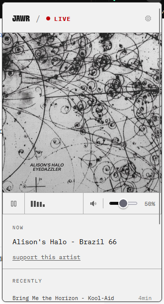
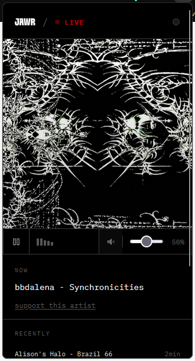

# jawr-browser-ext

Browser extension for [jawr.org](https://jawr.org) - a 24/7 curated web radio.

<p align="center">
  
  
</p>

## Features

- One-click play/pause, volume, mute
- Now-playing with cover art and history
- Live FFT visualization
- Track-change notifications (opt-in)
- Keyboard shortcuts
- 9 themes, English + Portuguese
- Mini player mode

## Install

- Chrome / Edge: [Web Store](#) (coming soon)
- Firefox: [AMO](#) (coming soon)

## Development

```
npm ci
npm run dev             # Chrome
npm run dev:firefox     # Firefox
```

Build: `npm run build` / `npm run build:firefox`.

## Stack

[WXT](https://wxt.dev), React 19, TypeScript, Tailwind CSS 4.

## License

MIT
